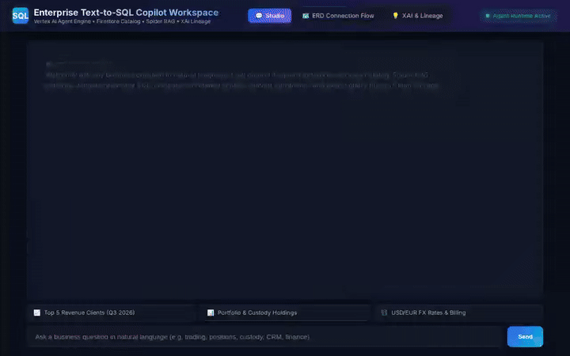

# 🤖 Enterprise Text-to-SQL Copilot

> Enterprise-grade, schema-grounded, and read-only Text-to-SQL AI Agent built with Google Agent Development Kit (ADK), Vertex AI Agent Engine, Memory Bank, Firestore, and Cloud Storage.



---

## 🌟 Overview

**Enterprise Text-to-SQL Copilot** transforms natural language business questions into deterministic, schema-aligned, and read-only BigQuery SQL queries. It automates complex enterprise data queries across **CRM, Operations, Finance, HR, Trading, Portfolio, and Custody** domains while enforcing strict AST read-only safety guardrails, confidence scoring, multi-currency conversion, and query export capabilities.

---

## 🏗️ Architecture & Wired Google Cloud Services

The project integrates the following Google Cloud infrastructure and tools:

```
┌───────────────────────────────┐
│     FastAPI / Web Studio      │  ◄── Multi-page ERD Flow & XAI Workspace
└──────────────┬────────────────┘
               │
               ▼
┌───────────────────────────────┐
│   Vertex AI Agent Engine      │  ◄── Agent Runtime (ADK / Gemini 3.7 Flash)
└──────┬──────────────┬─────────┘
       │              │
       ▼              ▼
┌───────────────┐  ┌───────────────┐  ┌───────────────────────────────┐
│  Memory Bank  │  │   Firestore   │  │  Google Cloud Storage (GCS)   │
│ Persistence   │  │ Schema Catalog│  │ Public Query Asset Export     │
└───────────────┘  └───────────────┘  └───────────────────────────────┘
```

### 1. Vertex AI Agent Engine (`ReasoningEngine`)
- Containerized Agent Runtime hosting Google ADK (`app/agent.py`) powered by Gemini 3.7 Flash.
- Implements SSE streaming protocol via `:streamQuery` and multi-turn session persistence.

### 2. Vertex AI Memory Bank
- Uses `PreloadMemoryTool` and `after_agent_callback` (`add_session_to_memory`) to extract and recall user domain preferences, dialect defaults, and custom alias mappings across sessions.

### 3. Google Cloud Firestore
- Stores full enterprise schema metadata in `schema_catalog` collection (`clients`, `projects`, `invoices`, `payments`, `employees`, `tasks`, `time_logs`, `customer_feedback`, `trades`, `positions`, `custody`).
- Records schema enhancement proposals in `schema_requests` collection.

### 4. Google Cloud Storage (GCS)
- Exports validated SQL query assets into public bucket `text-to-sql-copilot-public-c95bba96` as shareable `.sql` files.

---

## 🛠️ Integrated Function Tools

| Tool Name | Type | Description |
| :--- | :--- | :--- |
| `get_schema_catalog` | **Firestore Read** | Dynamically loads schema tables, column definitions, primary keys, and foreign keys with domain filtering. |
| `search_spider_sql_patterns` | **Spider RAG** | Matches natural language queries against Spider Text-to-SQL benchmark examples for syntax structure and reasoning. |
| `get_currency_exchange_rates` | **Public Financial API** | Calls Frankfurter API for live European Central Bank foreign exchange conversion rates. |
| `validate_read_only_sql` | **AST Safety Guardrail** | Validates that queries start with `SELECT`/`WITH` and blocks state-modifying keywords (`DROP`, `DELETE`, `UPDATE`, `INSERT`). |
| `calculate_confidence_score` | **Gating Metric** | Computes 0–100% confidence score and assigns `HIGH`/`MEDIUM`/`LOW` bands based on schema alignment. |
| `export_query_to_cloud_storage` | **GCS Exporter** | Uploads formatted SQL files to Cloud Storage and generates public download URLs. |
| `create_schema_request` | **Firestore Write** | Logs user schema proposals or extension requests into Firestore. |
| `list_schema_requests` | **Firestore Read** | Queries submitted schema requests and governance statuses. |

---

## 💻 Local Setup & Execution

### Prerequisites
- Python 3.11+
- `uv` package manager (`pip install uv`)
- Node.js 18+ (for running Playwright demo scripts)

### Installation

1. Clone the repository:
   ```bash
   git clone https://github.com/shasanksingh/buidlwithgemini-text-to-sql-copilot.git
   cd buidlwithgemini-text-to-sql-copilot
   ```

2. Install dependencies:
   ```bash
   uv sync
   ```

3. Seed Firestore collections (Schema Catalog & Spider Patterns):
   ```bash
   uv run python scripts/seed_firestore.py
   ```

4. Launch the local FastAPI enterprise workspace:
   ```bash
   uv run python frontend/main.py
   ```

5. Open your browser and navigate to the port output by the server to access the **Studio**, **ERD Connection Flow**, and **XAI Studio**.

---

## 📹 Recording UI Demos

Generate an automated screen recording of the agent driving the UI with Playwright and ffmpeg:

```bash
node .agents/skills/record-demo/record-agent.js \
  -q "Find top 5 revenue clients in Q3 2026 joining sales_orders and customer_profiles." \
  -q "Show active portfolio holdings and total market value by client in positions and custody tables." \
  --wait 20000 --speed 1.5 -o agent_demo.webm
```

Convert the `.webm` recording to an optimized looping GIF:
```bash
ffmpeg -y -i agent_demo.webm -vf "fps=12,scale=720:-1:flags=lanczos,split[s0][s1];[s0]palettegen[p];[s1][p]paletteuse" -loop 0 agent_demo.gif
```

---

## 📜 License
Apache License 2.0
